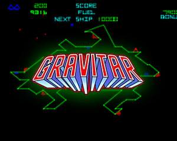

# Project Non-Gravitar


University of Bologna 2018/19 Programming project (CS course), aiming to
produce a reduced C++ implementation of the Atari 1982 game
[Gravitar](https://en.wikipedia.org/wiki/Gravitar).


## Usage
Non-Gravitar features the following list of commands

<table>
	<thead>
		<tr>
			<th>Command</th>
			<th>Effect</th>
		</tr>
	</thead>
	<tbody>
		<tr><td>`w`</td><td>Accelerate spaceship</td></tr>
		<tr><td>`a`</td><td>Rotate spaceship counter-clockwise</td></tr>
		<tr><td>`d`</td><td>Rotate spaceship clockwise</td></tr>
		<tr><td>`k`</td><td>Activate tractor beam</td></tr>
		<tr><td>`space bar`</td><td>Shoot missiles</td></tr>
	</tbody>
<table>

Aim of the game is recording the highest possible score by entering into
planets and striking all bunkers. Once all of bunkers in a planet have been
cleared, that planet will undergo destruction. And when all planets of a solar
system have been cleared, you'll be taken into a new solar system. Be careful
to not go out of fuel!

## Installing
In order to compile this project, first ensure you have all the needed
dependencies:

* The [SFML library](https://www.sfml-dev.org/)

Once you have completed your setup, simply issue the following commands

```
mkdir build
cd build
cmake ..
make NonGravitar # (1)
./NonGravitar # (2)
```

## Testing
This project possesses a reasonable unit-testing suite, written according to
[Catch2](https://github.com/catchorg/Catch2). In order to run it, simply
substitute commands `(1)` and `(2)` above with

```
make test-all
./test-all
```
